Thomas Philibert, Matthieu Nastorg et Tara Vanhatalo.
# Rapport TP1
## Séance 1, partie 2
###  1. Euler explicite pour y'(t) = 1-y avec y(0) = 5
**Valeur de l'erreur en fonction de h:**

| h       | Erreur                |
|:-------:|:---------------------:|
| 0.2     | 0.06506033134105892   |
| 0.1     | 0.031075643227486384  |
| 0.05    | 0.015202834302256153  |
| 0.025   | 0.00752088671982899   |
| 0.0125  | 0.003740692714979372  |
| 0.00625 | 0.0018654552588085824 |

**Comparaison avec la solution exacte:**

[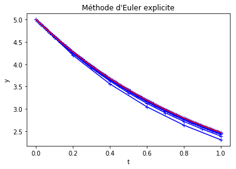](img/EulerExF1.png)

**Graphe de convergence:**

[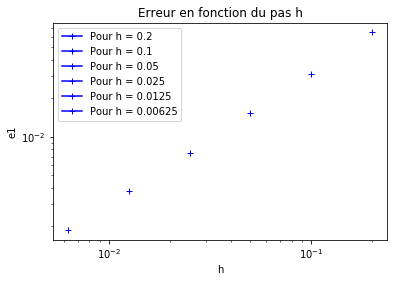](img/EulerExF1Err.png)

### 2. Euler explicite pour y'(t) = 1-y^2 avec y(0) = 0
**Valeur de l'erreur en fonction de h:**

| h       | Erreur                |
|:-------:|:---------------------:|
| 0.2 | 0.05154271164709365 |
|0.1 | 0.025230901150132417 |
|0.05 | 0.012443814368973037 |
|0.025 | 0.006178101429809816 |
|0.0125 | 0.0030783025937682084  |

**Comparaison avec la solution exacte:**

[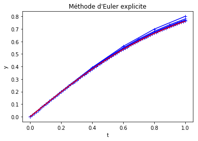](img/EulerExF2C1.png)

**Graphe de convergence:**

[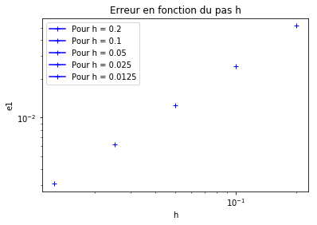](img/EulerExF2C1Err.png)

### Euler explicite pour y'(t) = 1-y^2 avec y(0) = 2
**Valeur de l'erreur en fonction de h:**

| h       | Erreur                |
|:-------:|:---------------------:|
| 0.2 | 0.11137124429436343 |
| 0.1 | 0.04497215564708265 |
| 0.05 | 0.020980810348097192 |
| 0.025 | 0.010160149344250627 |
| 0.0125 | 0.00500229386518795|

**Comparaison avec la solution exacte:**

[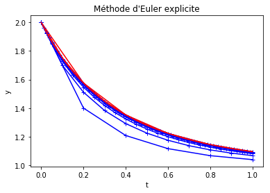](img/EulerExF2C2.png)

**Graphe de convergence:**

[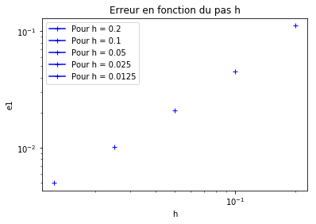](img/EulerExF2C2Err.png)

### 3. Runge-Kutta 2 pour y'(t) = 1-y avec y(0) = 5
**Valeur de l'erreur en fonction de h:**

| h       | Erreur                |
|:-------:|:---------------------:|
| 0.2 | 0.004629385342769428 |
| 0.1 | 0.001070667865005106 |
| 0.05 | 0.00025762388227810524 |
| 0.025 | 6.319767711300863e-05 |
| 0.0125 | 1.5651247806977652e-05 |
| 0.00625 | 3.894467125035026e-06 |

**Comparaison avec la solution exacte:**

**Graphe de convergence:**

### Runge-Kutta pour y'(t) = 1-y^2 avec y(0) = 0
**Valeur de l'erreur en fonction de h:**

| h       | Erreur                |
|:-------:|:---------------------:|
| 0.2 | 0.0031649335610156224 |
| 0.1 | 0.0008227854423354975 |
| 0.05 | 0.00020767373095655886 |
| 0.025 | 5.2042102567435896e-05 |
| 0.0125 | 1.3018256322779525e-05 |

**Comparaison avec la solution exacte:**

**Graphe de convergence:**

[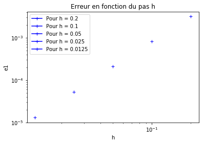](img/RK2F2C1Err.png)

### Runge-Kutta pour y'(t) = 1-y^2 avec y(0) = 2
**Valeur de l'erreur en fonction de h:**

| h       | Erreur                |
|:-------:|:---------------------:|
| 0.2 | 0.03253161873110856 |
| 0.1 | 0.0061821733441151765 |
| 0.05 | 0.0013405166859040264 |
| 0.025 | 0.00031276896055471335 |
| 0.0125 | 7.553937980781941e-05 |

**Comparaison avec la solution exacte:**

**Graphe de convergence:**

[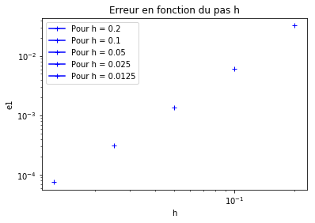](img/RK2F2C2Err.png)

### 3bis. Comparaison des converges

Les points calculés par Euler Explicite sont en bleu et ceux calculés par Runge-Kutta 2 sont en rouge.

**y'(t) = 1-y avec y(0) = 5**

[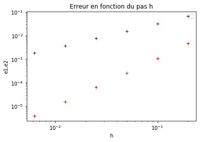](img/CompF1.png)

**y'(t) = 1-y^2 avec y(0) = 0**

[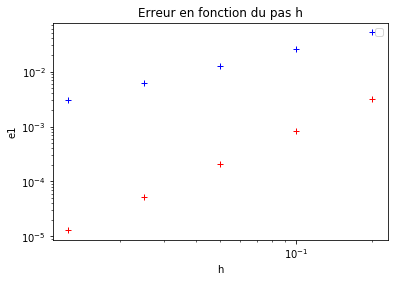](img/CompF2C1.png)

**y'(t) = 1-y^2 avec y(0) = 2**

[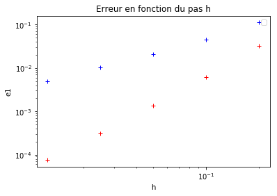](img/CompF2C2.png)

### Commentaire:
On remarque bien que la méthode de Runge-Kutta d'ordre 2 est plus précise et converge plus rapidement que celle d'Euler explicite.

### 4. Méthode de Saute-Mouton pour y'(t) = 1-y avec y(0) = 5
**Valeur de l'erreur en fonction de h:**

| h       | Erreur                |
|:-------:|:---------------------:|
| 0.2 | 0.004390110186244502 |
| 0.1 | 0.0009652100860111599 |
| 0.05 | 0.0002463707871696083 |
| 0.025 | 6.191281744850632e-05 |
| 0.0125 | 1.54982648355215e-05 |
| 0.00625 | 3.875820817240393e-06 |

**Comparaison avec la solution exacte:**

**Graphe de convergence:**

[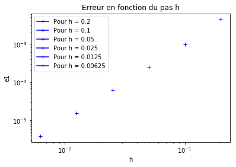](img/SMF1Err.png)

### Méthode de Saute-Mouton pour y'(t) = 1-y^2 avec y(0) = 0
**Valeur de l'erreur en fonction de h:**

| h       | Erreur                |
|:-------:|:---------------------:|
| 0.2 | 0.011500064953039676 |
| 0.1 | 0.0032155351255304877 |
| 0.05 | 0.0008259198722488653 |
| 0.025 | 0.0002078691909182984 |
| 0.0125 | 5.205431190321056e-05 |

**Comparaison avec la solution exacte:**

[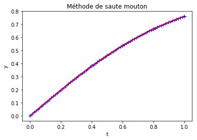](img/SMF2C1.png)

**Graphe de convergence:**

### Méthode de Saute-Mouton pour y'(t) = 1-y^2 avec y(0) = 2
**Valeur de l'erreur en fonction de h:**

| h       | Erreur                |
|:-------:|:---------------------:|
| 0.2 | 0.12581677506928973 |
| 0.1 | 0.009472270452480327 |
| 0.05 | 0.00141560040601663 |
| 0.025 | 0.0003730629634605818 |
| 0.0125 | 9.228116827941486e-05 |

**Comparaison avec la solution exacte:**

[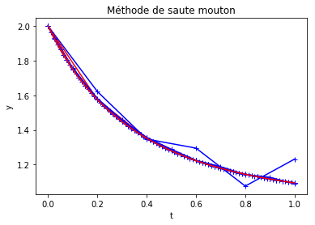](img/SMF2C2.png)

**Graphe de convergence:**

[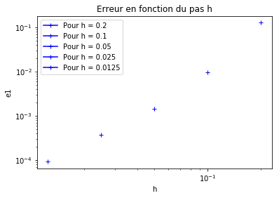](img/SMF2C2Err.png)

### 5. Méthode du Trapèze (Prédiction-Correcteur) pour y'(t) = 1-y avec y(0) = 5
**Valeur de l'erreur en fonction de h:**

| h       | Erreur                |
|:-------:|:---------------------:|
| 0.2 | 0.004629385342769428 |
| 0.1 | 0.001070667865005106 |
| 0.05 | 0.00025762388227810524 |
| 0.025 | 6.319767711300863e-05 |
| 0.0125 | 1.5651247806977652e-05 |
| 0.00625 | 3.8944671248553435e-06 |

**Comparaison avec la solution exacte:**

[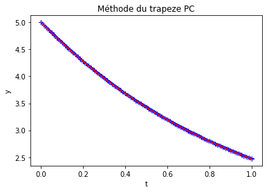](img/TPCF1.png)

**Graphe de convergence:**

### Méthode de Trapèze (Prédiction-Correcteur) pour y'(t) = 1-y^2 avec y(0) = 0
**Valeur de l'erreur en fonction de h:**

| h       | Erreur                |
|:-------:|:---------------------:|
| 0.2 | 0.008067304792243258 |
| 0.1 | 0.0018724770347221169 |
| 0.05 | 0.0004517177163397446 |
| 0.025 | 0.0001109057440015871 |
| 0.0125 | 2.748082416725165e-05 |

**Comparaison avec la solution exacte:**

[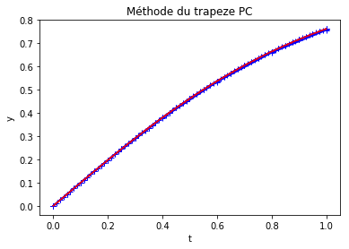](img/TPCF2C1.png)

**Graphe de convergence:**

[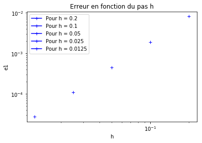](img/TPCF2C1Err.png)

### Méthode de Trapèze (Prédiction-Correcteur) pour y'(t) = 1-y^2 avec y(0) = 2
**Valeur de l'erreur en fonction de h:**

| h       | Erreur                |
|:-------:|:---------------------:|
| 0.2 | 0.020802376048901516 |
| 0.1 | 0.004405736221326589 |
| 0.05 | 0.0010069233350482858 |
| 0.025 | 0.0002394411775375868 |
| 0.0125 | 5.836645027214847e-05 |

**Comparaison avec la solution exacte:**

[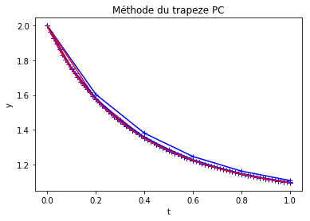](img/TPCF2C2.png)

**Graphe de convergence:**

### 5bis. Méthode du Trapèze (Newton) pour y'(t) = 1-y avec y(0) = 5
**Valeur de l'erreur en fonction de h:**

| h       | Erreur                |
|:-------:|:---------------------:|
| 0.2 | 0.0019932838611797965 |
| 0.1 | 0.0004966968766454026 |
| 0.05 | 0.00012407325705105106 |
| 0.025 | 3.101201256699292e-05 |
| 0.0125 | 7.752609417133195e-06 |
| 0.00625 | 1.9381277485219057e-06 |

**Comparaison avec la solution exacte:**

[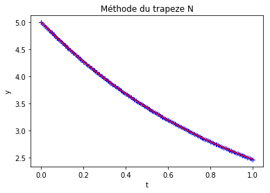](img/TNF1.png)

**Graphe de convergence:**

[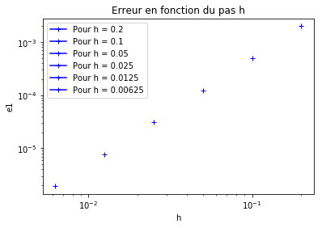](img/TNF1Err.png)

### Méthode de Trapèze (Newton) pour y'(t) = 1-y^2 avec y(0) = 0
**Valeur de l'erreur en fonction de h:**

| h       | Erreur                |
|:-------:|:---------------------:|
| 0.2 | 0.006195797513481729 |
| 0.1 | 0.001635994217516236 |
| 0.05 | 0.00041472915154039044 |
| 0.025 | 0.00010404524746699833 |
| 0.0125 | 2.603407287806165e-05 |

**Comparaison avec la solution exacte:**

[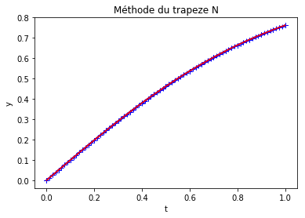](img/TNF2C1.png)

**Graphe de convergence:**

[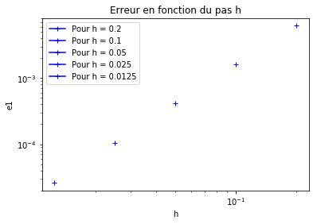](img/TNF2C1Err.png)

### Méthode de Trapèze (Newton) pour y'(t) = 1-y^2 avec y(0) = 2
**Valeur de l'erreur en fonction de h:**

| h       | Erreur                |
|:-------:|:---------------------:|
| 0.2 | 0.011843638955066611 |
| 0.1 | 0.0028947116254087607 |
| 0.05 | 0.0007147715663917582 |
| 0.025 | 0.00017857085462724066 |
| 0.0125 | 4.461033000169874e-05 |

**Comparaison avec la solution exacte:**

[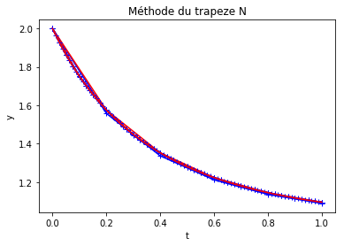](img/TNF2C2.png)

**Graphe de convergence:**

[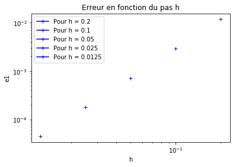](img/TNF2C2Err.png)

### 6. Comparaison des 4 méthodes (Euler, RK2, Saute-Mouton, Trapèze PC)
Comparaison des méthodes pour le problème de Cauchy: y'(t) = a*y(t) + (1-a)*cos(t) - (1+a)*sin(t), avec y(0)=1.

[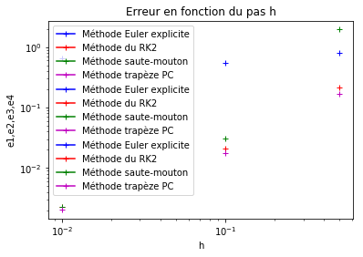](img/ErreurComp4.png)

[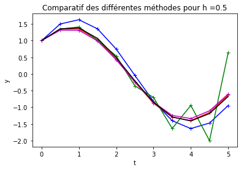](img/Comp4h05.png)

[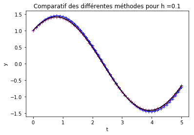](img/Comp4h01.png)

[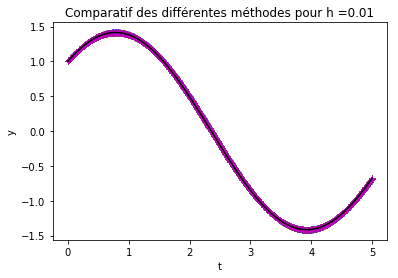](img/Comp4h001.png)

### 7. Module pour résoudre un système linéaire
Le système linéaire à résoudre est  y' = Ay avec A = diag(-1,-2), qui a pour solution exacte y(t) = exp(At)*y(0) avec y(0)=(1,1) et T=1.

**Solution approchée par Euler Explicite:**

[1.      0.8     0.64    0.512   0.4096  0.32768]

[1.      0.6     0.36    0.216   0.1296  0.07776]

**Solution approchée par Runge-Kutta d'ordre 2**

[1.      0.82       0.6724     0.551368   0.45212176     0.37073984]

[1.      0.68       0.4624     0.314432   0.21381376     0.14539336]

**Solution approchée par Saute-Mouton:**

[1.      0.82     0.672    0.5512   0.45152   0.370592]

[1.      0.68     0.456    0.3152   0.20384   0.152128]

**Solution approchée par Trapèze (Prédiction-Correcteur):**

[1.      0.82     0.6724     0.551368   0.45212176		0.37073984]

[1.      0.68     0.4624     0.314432   0.21381376		0.14539336]

**Solution exacte de l'équation:**

[1.      0.81873075      0.67032005      0.54881164      0.44932896      0.36787944]

[1.      0.67032005      0.44932896      0.30119421      0.20189652      0.13533528]

**Graphe de l'erreur en fonction de h (distance euclidienne)**

[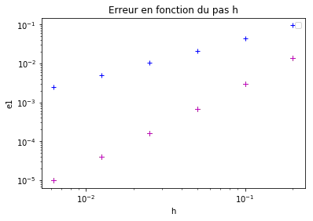](img/erreur.png)

Sur ce graphe, on s'apperçoit que la méthode d'Euler explicite (bleu) est celle qui commet la plus grosse erreur.
Les trois autres méthodes sont similaires dans ce cas.
